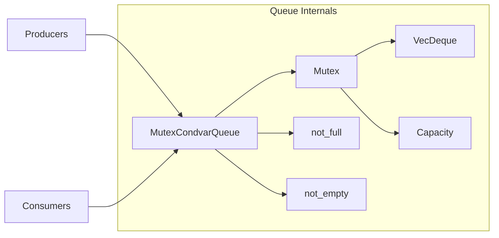
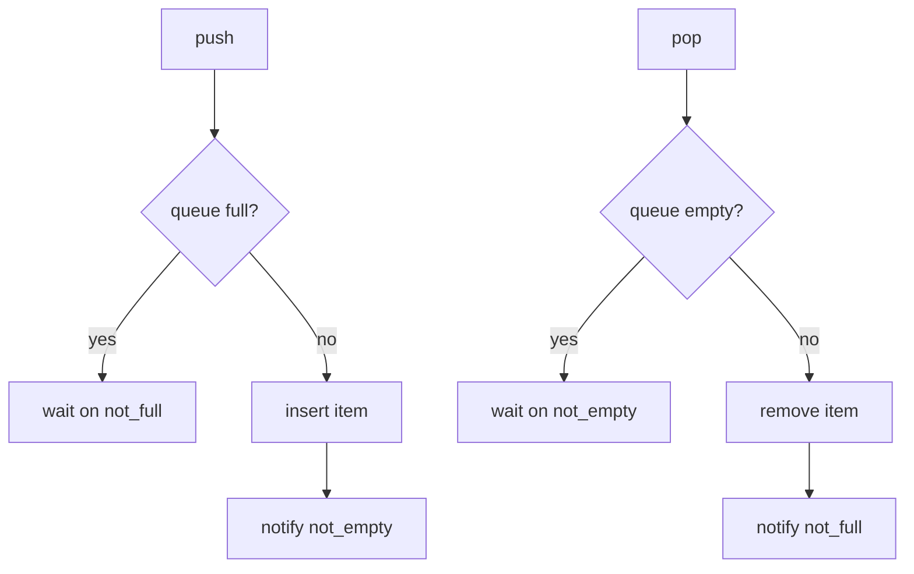

# Bounded MPMC Queue

This project implements a bounded multi-producer multi-consumer queue in Rust.

What that means:

- many threads can `push`
- many threads can `pop`
- if the queue is full, producers wait
- if the queue is empty, consumers wait
- `try_push` and `try_pop` do not wait

## High-Level Design

The queue uses:

- `Mutex` to protect shared state
- `Condvar` `not_full` to block producers when the queue is full
- `Condvar` `not_empty` to block consumers when the queue is empty
- `VecDeque<T>` as the FIFO buffer

Why this approach:

- simple to understand
- easy to prove correct
- uses only `std`
- good for this kind of queue

## Diagram

### Structure



### Queue Behavior



## Files

- [`src/lib.rs`](src/lib.rs): queue trait
- [`src/mutex_condvar.rs`](src/mutex_condvar.rs): queue implementation
- [`tests/`](tests/): correctness and contention tests
- [`src/bin/throughput.rs`](src/bin/throughput.rs): benchmark runner
- [`benchmarks/`](benchmarks/): benchmark outputs

## Tests

The tests cover:

- zero capacity rejection
- FIFO order
- blocking `push` and `pop`
- `try_push` and `try_pop`
- many producers and many consumers
- many producers and one consumer
- one producer and many consumers
- capacity `1` under contention
- repeated stress runs
- drop safety

Current test count:

- `13` integration tests passing

Why these tests matter:

- they check the easy cases
- they check blocking behavior
- they check heavy thread contention
- they help catch lost items, duplicate items, and deadlocks

## Benchmark Matrix

The benchmark runs:

- producer/consumer pairs: `1, 2, 4, 8, 16`
- capacities: `64, 256, 1024`
- asymmetric cases: `8/2` and `2/8`

Metric:

- throughput in operations per second
- reported as `(push_ops + pop_ops) / measured_secs`

Why this benchmark style was used:

- simple to run
- stable on normal Rust toolchains
- easy to compare different queue sizes and thread counts

## Benchmark Results

Release benchmark results are stored in:

- [`src/bin/throughput.rs`](src/bin/throughput.rs)
- [`benchmarks/benchmark_results.csv`](benchmarks/benchmark_results.csv)
- [`benchmarks/benchmark_results.md`](benchmarks/benchmark_results.md)

Some headline numbers:

- `1 producer / 1 consumer / cap 1024`: `72,338,366.67 ops/sec`
- `2 producers / 2 consumers / cap 1024`: `52,003,337.00 ops/sec`
- `4 producers / 4 consumers / cap 1024`: `29,394,815.33 ops/sec`
- `16 producers / 16 consumers / cap 1024`: `19,368,146.33 ops/sec`
- `8 producers / 2 consumers / cap 256`: `7,855,712.00 ops/sec`
- `2 producers / 8 consumers / cap 256`: `7,684,199.67 ops/sec`

Simple pattern:

- bigger capacity helped throughput
- more threads increased contention
- asymmetric workloads were slower than balanced ones

Benchmark caveat:

- this benchmark is a practical throughput runner, not a full statistics-heavy benchmark framework
- it is built to measure the queue clearly and simply
- this keeps the code easy to read and the results easy to compare

## Tradeoffs

This project chooses clarity over maximum speed.

Good parts:

- easier to read
- easier to debug
- easier to test
- no `unsafe`

Costs:

- one shared `Mutex` means more contention at high thread counts
- this will usually be slower than a good lock-free queue
- benchmark numbers are good, but not the best possible

## What Could Be Better

If this project had more time, these are the next upgrades:

- use a manual fixed ring buffer instead of `VecDeque<T>`
- add repeated benchmark runs and average the results
- record more machine details with the benchmark output
- compare this queue against a second implementation
- try a lock-free version as an experiment

Important note:

- a lock-free queue may be faster
- but it is much harder to write correctly
- it would likely need `unsafe` and atomics
- the current design is the safer tradeoff

## How To Run

```bash
cargo test
cargo run --release --bin throughput
```

## Summary

This project delivers:

- a `std`-only bounded MPMC queue
- blocking and non-blocking operations
- contention tests
- benchmark code
- benchmark results
